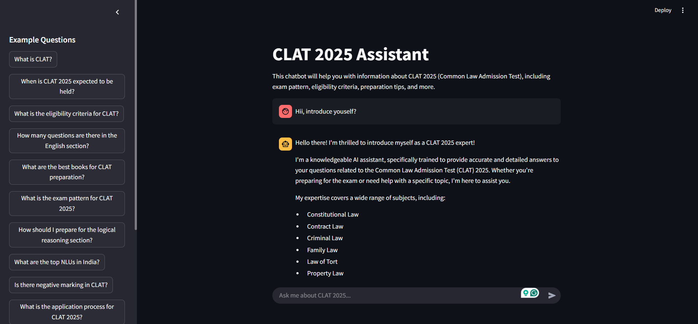

# CLAT Chatbot 

## Overview

This project is a prototype chatbot designed to assist CLAT aspirants by answering their queries related to the exam. The chatbot leverages either rule-based logic or NLP techniques (e.g., keyword search, spaCy, NLTK, or Transformers) to provide relevant responses from a small knowledge base or open-source CLAT syllabus and FAQs. This solution aims to support law aspirants in their preparation journey, aligning with NLTI's vision of mentorship and aspirant support.

---

## Features

- **Interactive Interface**: A user-friendly Streamlit interface for seamless interaction.
- **Context-Aware Responses**: Utilizes FAISS Vector Database and conversation history for enhanced contextual understanding.
- **Advanced AI Models**: Employs embedding models and Groq LLM for generating meaningful and relevant responses.
- **Scalable Architecture**: Modular design ensures easy scalability and maintenance.

---

## Project Architecture

The architecture of the chatbot application is visualized in the diagram below:

### Key Components

1. **Frontend**
   - **User**: Represents the end-user interacting with the application.
   - **Streamlit Interface**: A web-based frontend powered by Streamlit, enabling real-time interaction with the chatbot.

2. **Backend**
   - **Chatbot Application**: The core backend logic that handles user requests, manages data flow, and orchestrates interactions between various components.
   - **Context Retrieval**: Retrieves relevant context from the FAISS Vector Database and Conversation History.
   - **Prompt Creation**: Constructs prompts based on retrieved context and user input.
   - **Response Generation**: Generates responses using the Groq LLM.

3. **Database**
   - **FAISS Vector DB**: A high-performance vector database used for efficient storage and retrieval of embeddings.
   - **Conversation History**: Stores past interactions to maintain continuity in conversations.

4. **AI Models**
   - **Embedding Model**: Converts text into numerical representations (embeddings) for processing.
   - **Groq LLM**: A powerful large language model accessed via the Groq API to generate human-like responses.

5. **External Integration**
   - **Groq API**: Provides access to the Groq LLM for advanced natural language processing capabilities.
   - **HuggingFace API**: Provides access to Open Source Huggingafce embedding model for advanced natural language processing capabilities and RAGS application.

---

## Workflow

1. **User Interaction**:
   - The user interacts with the chatbot through the Streamlit interface.
   - The user's question is captured and passed to the backend.

2. **Context Retrieval**:
   - The backend retrieves relevant context from the FAISS Vector Database and Conversation History.

3. **Prompt Creation**:
   - Based on the retrieved context, a prompt is created and sent to the Groq LLM.

4. **Response Generation**:
   - The Groq LLM processes the prompt and generates a response.
   - The response is then relayed back to the Streamlit interface for display.

---

## Screenshots

Here is a preview of the Streamlit interface:

---

## Installation and Setup

### Prerequisites

- Python 3.8+
- Streamlit
- FAISS
- Groq API Key
- Embedding Model (e.g., Hugging Face Transformers)